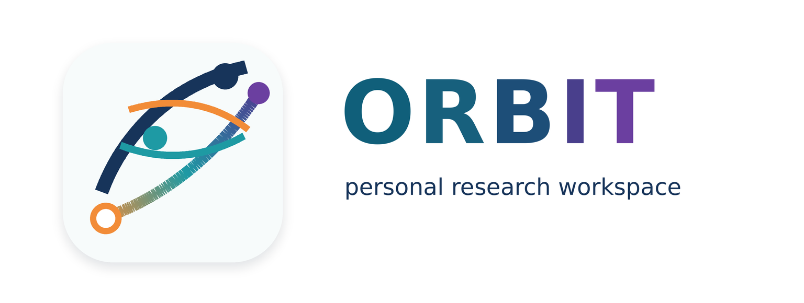

  

<h1 align="center">ORBIT</h1>

<strong>Orchestrated Research, Benchmarking, and Iterative Training</strong>

## About

ORBIT is a personal research workspace for turning experiments into repeatable
remote runs. It keeps local planning, configuration, and audit records separate
from the machines that execute the work, so training, evaluation, and data
collection jobs can be launched, inspected, and reproduced without relying on
one-off shell sessions.

The project is built around explicit execution templates, bundle artifacts, and
clear control-plane / execution-plane boundaries. It is intended for practical
model and environment iteration rather than as a hosted platform or an
organization-branded product.

The main workflow is straightforward: operate jobs locally, execute them on
Targon rental machines, and collect logs and artifacts through explicit
templates instead of ad-hoc remote orchestration.

## Overview

ORBIT is organized around four concerns:

- `control plane`: experiment records, task orchestration, template selection,
  and run inspection
- `execution plane`: generic bundles, placement backends, launch modes, and
  artifact collection
- `task plugins`: training, evaluation, and collection request shaping
- `sidecars`: operational helpers such as remote ops and monitoring

The default documented workflow is:

- local `control`
- remote `targon_rental`
- launch mode `host_process`
- template `targon-rental-host`

## Features

- Targon-first remote execution from a local control plane
- explicit execution templates instead of hidden runtime branching
- bundle-based execution with runtime audit logs
- separate control-plane and execution-plane responsibilities
- official config-driven remote training example
- native `ms-swift` SFT and RLHF workflows through `orbit control launch train`
- `uv`-based setup as the default environment workflow

## Documentation

Start here:

- [Getting Started](docs/getting-started.md): first remote run on Targon
- [User Guide](docs/user-guide.md): how to think about workflows, targets, and
  command families

Reference:

- [Documentation Hub](docs/README.md)
- [Architecture](docs/architecture.md)
- [CLI Guide](docs/cli.md)
- [Operations Guide](docs/operations.md)
- [Official Remote Examples](docs/official-examples.md)
- [Testing Guide](docs/testing.md)
- [Test Runbook](docs/test-runbook.md)

## Project Status

Supported execution matrix:

- `local + host_process`
- `local + docker_image`
- `targon_rental + host_process`
- `targon_rental + docker_image`

Primary documented and validated path:

- local `control` -> `targon_rental + host_process`
- this path has been real-validated for config-driven remote training,
  including native `ms-swift` SFT and GKD configs submitted through
  `launch train`

Other paths remain available but are documented as secondary.

## Community

- [LICENSE](LICENSE)
- [NOTICE](NOTICE)
- [THIRD_PARTY_NOTICES.md](THIRD_PARTY_NOTICES.md)
- [CONTRIBUTING.md](CONTRIBUTING.md)
- [CODE_OF_CONDUCT.md](CODE_OF_CONDUCT.md)
- [SECURITY.md](SECURITY.md)

## Open Source Notes

- Direct dependencies are declared in [pyproject.toml](pyproject.toml) and
  resolved in [uv.lock](uv.lock).
- Training uses upstream `ms-swift` directly. ORBIT's role is to validate
  config, build bundles, provision execution targets, and submit runs.
