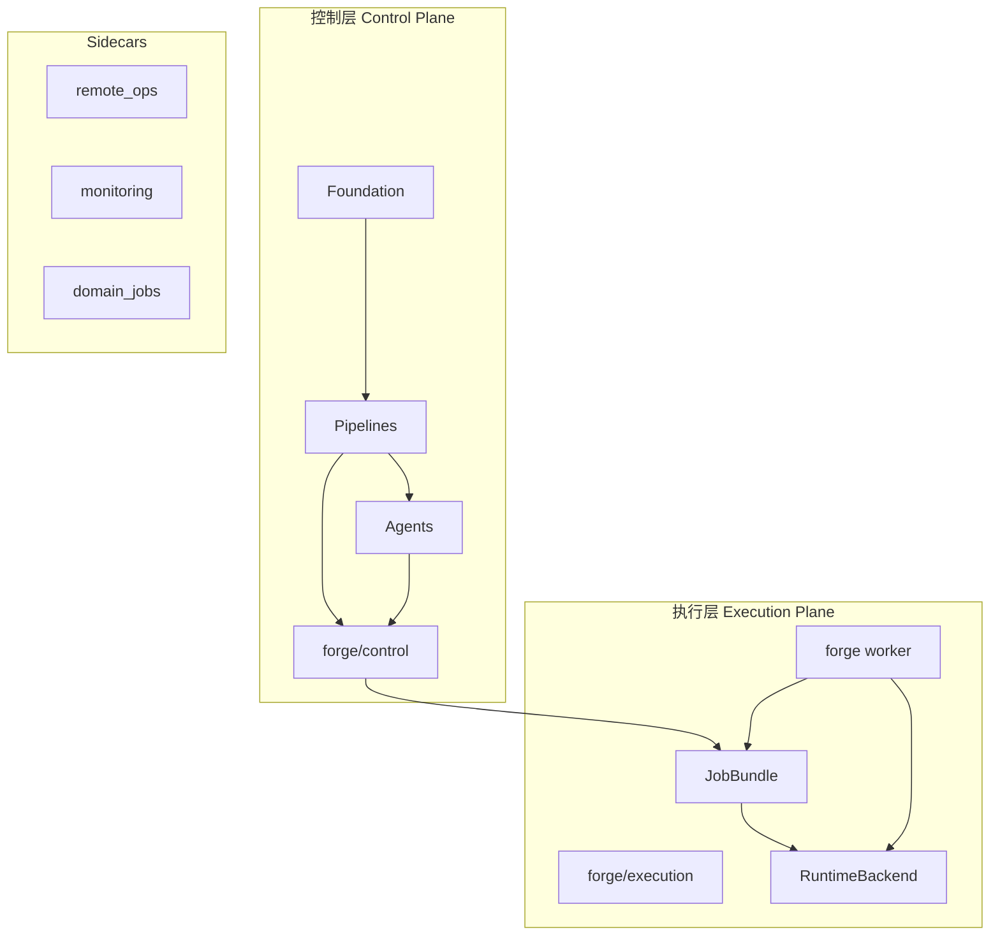
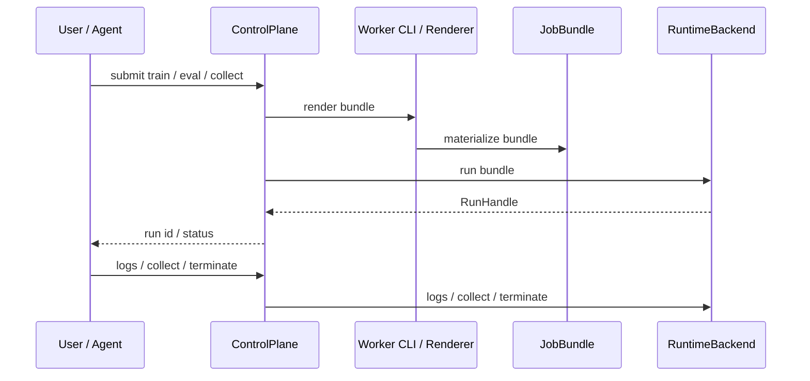

# 架构与设计说明

本文档描述当前代码库的长期结构。它只回答一件事：**项目现在应该怎样理解和扩展**。

重构路线、里程碑和测试治理不在这里维护；那部分内容统一放在 [`docs/refactor/`](refactor/README.md) 和仓库根目录的 [`AGENTS.md`](../AGENTS.md)。

## 1. 总体结构

当前系统分成两个平面，加上一组独立 sidecar：

- 控制层：定义任务、提交任务、跟踪状态、汇总结果、驱动 agent
- 执行层：真正运行 `train / eval / collect`
- Sidecar：远程运维、监控、领域专项能力



这个结构的核心目的不是“多拆几个目录”，而是把三类变化频率完全不同的能力分开：

- 稳定的产品逻辑
- 真正的运行时执行
- 偏操作性的附属能力

## 2. 控制层

控制层内部保留三层主干：

- Layer 0: `Foundation`
- Layer 1: `Pipelines`
- Layer 2: `Agents`

另外，控制层还有显式的控制面服务：

- `forge/control/experiment.py`
- `forge/control/service.py`
- `forge control`

### 2.1 Foundation

Foundation 放稳定原语和可复用契约，典型内容包括：

- 训练与评测请求
- 环境目录与环境定义
- canonical repository
- message packer
- scoring
- evaluation runner

这里的原则是：

- 不依赖 import side effect
- 不隐藏全局状态
- 契约小而显式
- 环境相关 shaping 放进环境定义或 packer，而不是 CLI 胶水代码

### 2.2 Pipelines

Pipelines 负责业务编排，例如：

- 数据清洗与 canonical 写入
- 训练数据构建
- 评测触发与结果汇总

Pipeline 要表达**真实路径**，不能只是一个占位抽象。

### 2.3 Agents

Agents 只做高层决策和编排，不直接拥有 runtime 细节。

当前重要约束：

- agent 不直接启动 Targon / SSH / Docker
- agent 不直接拼 runtime 参数
- agent 通过 `ControlPlane` 提交任务

这保证了 agent 关心的是“要做什么”，而不是“某台机器怎么拉起来”。

### 2.4 ControlPlane

`ControlPlane` 是控制层的统一入口，负责：

- 创建和保存 experiment
- 渲染 train / eval / collect bundle
- 提交任务到执行层
- 查询状态
- 读取日志
- 收集产物
- 终止运行

控制层对外的稳定公共面是 `forge control`，而不是旧的 `forge train` / `forge eval`。

## 3. 执行层

执行层的职责很单纯：**把一个任务 bundle 真正跑起来**。

当前主包：

- `forge/execution/`

当前主 CLI：

- `forge worker`

### 3.1 核心对象

执行层围绕以下对象组织：

- `JobSpec`
- `TrainTaskSpec`
- `EvalTaskSpec`
- `CollectTaskSpec`
- `JobBundle`
- `RunHandle`
- `RunStatus`
- `ArtifactManifest`
- `RuntimeBackend`

### 3.2 Bundle-first 边界

执行层的稳定边界不是控制层内部对象，而是一个可落盘的 bundle：

- `job.json`
- `inputs/`
- `scripts/entrypoint.sh`
- `artifacts/manifest.json`
- `runtime/`

好处是：

- 可审计
- 可复制
- 可重放
- 可脱离控制层单独运行

### 3.3 RuntimeBackend

runtime 只处理“怎么跑”，不重新定义任务语义。

当前运行后端包括：

- `DockerRuntime`
- `SshRuntime`
- `TargonRuntime`

其中 Targon 有两个显式 profile：

- `bootstrap`
- `image`

它们必须显式选择，不能自动 fallback。

### 3.4 执行链路



## 4. Sidecar

Sidecar 是项目必须有、但不应污染控制层或执行层边界的模块。

当前保留：

- `forge/remote_ops/`
- `forge/monitoring/`
- `forge/domain_jobs/`

约束：

- sidecar 要小而专注
- 通过显式契约接入核心系统
- 不承接核心领域规则
- 不作为“放杂逻辑”的垃圾桶

## 5. 公开 CLI 结构

当前公开 CLI 家族：

- `data`
- `control`
- `worker`
- `remote`
- `monitor`

其中：

- `control` 是控制层入口
- `worker` 是执行层入口
- `remote` / `monitor` 是 sidecar

旧的 `forge train` / `forge eval` 不再是公开主路径。

## 6. 关键设计原则

### 6.1 控制层和执行层必须显式分离

控制层负责：

- 定义任务
- 记录 experiment
- 决策与编排

执行层负责：

- 渲染 bundle
- 启动任务
- 读取运行状态
- 回收日志与产物

### 6.2 组合优先于继承

模块通过显式协作者组装，而不是通过层层继承树堆出来。

### 6.3 不允许隐藏全局状态

- 不允许 import side effect 注册
- 不允许靠导入顺序决定系统行为
- 不允许把全局可变 registry 当主动架构

### 6.4 状态语义要诚实

- experiment 顶层 `status` 只表示训练生命周期
- `eval` / `collect` 的状态写入自己的 run record
- 不能让不同任务争抢同一个状态位

### 6.5 真实路径优先

- pipeline 不能是假入口
- agent 不能伪造成功
- 评测语义不能和文档宣称不一致

## 7. 数据、训练、评测如何串起来

### 7.1 数据

```text
raw samples
  -> data ingest / validate
  -> canonical repository
  -> aggregate / build dataset
  -> train jsonl
```

### 7.2 训练

```text
experiment + dataset
  -> forge control submit-train
  -> bundle render
  -> forge worker / runtime backend
  -> remote training process
  -> logs / artifacts / status
```

### 7.3 评测

```text
model + envs
  -> forge control submit-eval
  -> eval bundle
  -> runtime backend
  -> eval output + summary
```

## 8. 什么时候看哪份文档

- 想理解系统长期结构：看本文档
- 想知道命令怎么用：看 [cli.md](cli.md)
- 想知道运行和远程环境怎么操作：看 [operations.md](operations.md)
- 想知道测试怎么跑：看 [testing.md](testing.md)
- 想知道重构现在做到哪一步：看 [refactor/progress.md](refactor/progress.md)
