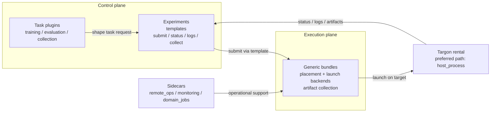
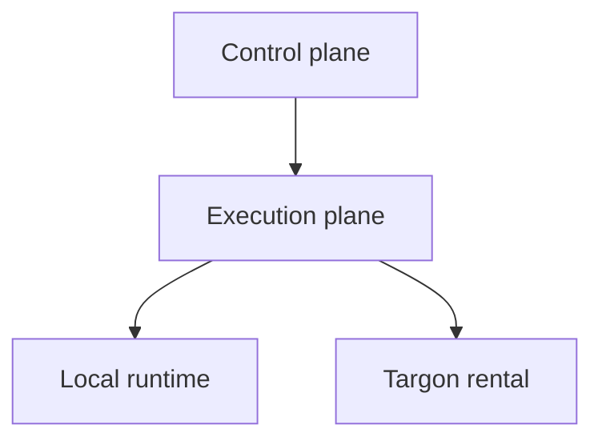

# Architecture

This document describes the current repository architecture. It covers the
stable concepts and boundaries that are visible in the codebase today. It does
not replay the historical refactor narrative in detail.

## User Mental Model

The default way to think about ORBIT is:

- run the control plane locally
- submit work through an execution template
- execute the job on a Targon rental
- collect artifacts and runtime logs after the run

Other execution combinations exist, but the primary documented path is local
`control` plus `targon_rental + host_process`.

## System Model

ORBIT is organized as a two-plane system with explicit task plugins and
sidecars:

- `control plane`
- `execution plane`
- `task plugins`
- `sidecars`

The shortest practical picture is:

## Control Plane

Primary locations:

- `orbit/core/control`
- `orbit/core/experiments`
- `orbit/core/templates`
- `orbit/control` compatibility facade
- `orbit/cli_control.py`

Current responsibilities:

- store experiment records
- resolve task plugins and execution templates
- resolve `template + overrides -> execution request`
- submit runs, query status, read logs, collect artifacts
- persist run metadata and audit records

Current public model:

- control paths are template-driven
- submit paths are based on `template_id + overrides`
- task-specific specs live above the execution core

## Execution Plane

Primary locations:

- `orbit/core/execution`
- `orbit/execution` compatibility facade
- `orbit/cli_worker.py`

Current responsibilities:

- define generic bundle layout
- define generic execution contracts
- own placement and launch-mode backends
- execute bundles
- collect logs, artifacts, and terminal state

Execution-plane core is task-agnostic. It does not treat training, evaluation,
or collection as special runtime types.

## Task Plugins

Primary locations:

- `orbit/tasks/training`
- `orbit/tasks/evaluation`
- `orbit/tasks/collection`

Current responsibilities:

- parse and validate task-specific requests
- build generic execution bundles
- summarize task-specific outputs after artifact collection

The core control kernel depends on explicit plugin registration. It does not
import task implementations directly.

## Data-Side SWE Collection

SWE trajectory generation now lives in a dedicated data-side collection
subsystem under `orbit/data/swe_collection/`.

Current responsibilities:

- load SWE task records from cache or task-pool sources
- provision isolated Docker workspaces for `/app`
- build a hidden oracle from the ground-truth patch:
  - touched files
  - touched symbols
  - edit-type guess
  - related tests
  - patch-size bounds
- optionally build one issue-level teacher rubric that is reused across all
  student rollouts for the same issue
- run cascade search for `miniswe` and `codex`:
  - localization shortlist
  - patch-plan shortlist
  - full patch realization only on shortlisted branches
- record full realization trajectories plus per-step workspace state snapshots
- run near-miss-only teacher repair after sampling, not full teacher takeover
- build staged bucket outputs:
  - `A`: autonomous student success
  - `B`: critical-step correction
  - `C`: patch repair
  - `V`: verifier / PRM training rows
- keep `canonical/` as the A-bucket success surface only, while raw facts live
  under `raw/`, `oracle/`, `search/`, `states/`, `relabels/`, `buckets/`,
  and `manifests/`

Current supported SWE student formats:

- `miniswe`
- `codex`

Boundary rule:

- this subsystem belongs to data collection, not ORBIT control-plane core and
  not execution-plane core
- online sampling never exposes hidden oracle labels to the student
- task `patch` / `ref_files` may assist hidden scoring and failure localization,
  but they are not injected into the online student prompt
- teacher calls are constrained to rubric construction and near-miss repair,
  not end-to-end teacher solving
- canonical SWE rows now use unique sample-level `instance_id` values and keep
  the original issue id in `base_instance_id`
- Codex collection uses a native Codex-style agent loop; it does not rely on
  MiniSWE-to-Codex conversion on the active path

## Internal RL Package Boundaries

The repository now also has an explicit internal RL package split for ongoing
refactor work. These packages live in the same monorepo, but they are not part
of the ORBIT control-plane core:

- `packages/rl_runtime`: RL runtime contracts, topology metadata, and the
  versioned trajectory/runtime manifest surface
- `packages/affine_ms_swift`: validated `ms-swift` backend profiles and
  backend-owned compatibility metadata, including the locally maintained
  `ms-swift` fork under `packages/affine_ms_swift/vendor/ms_swift_fork`
- `packages/env_memorygym`: MemoryGym environment protocol, action codec,
  reward semantics, and env-specific telemetry
- `packages/env_affinetes`: AffineTES env-pack scaffold and public API

Current boundary rule:

- ORBIT core does not import these package internals
- composition happens in `orbit/integrations/`
- task plugins may consume only the package public `api.py` modules while the
  old direct `swift_passthrough` / external-plugin path remains as a migration
  compatibility layer

This package split does not change the external user mental model yet. Users
still operate through the normal ORBIT control plane and execution templates.

## Sidecars

Current sidecars:

- `orbit/remote_ops`
- `orbit/monitoring`
- `orbit/domain_jobs`

Sidecars are intentionally separate from the two planes. They may support
operational workflows, debugging, or domain-specific tooling, but they should
not silently become the main architecture path.

## Core Concepts

### Execution Template

An execution template is the control-plane registration unit.

It describes execution strategy rather than a specific machine. In practice it
captures:

- placement
- launch mode
- default image
- default resource request
- default execution behavior such as detach mode
- allowed overrides

### Placement

Current public placements:

- `local`
- `targon_rental`

### Launch Mode

Current public launch modes:

- `host_process`
- `docker_image`

### Bundle

A bundle is the execution-plane handoff artifact. It contains:

- `job.json`
- `inputs/`
- `scripts/entrypoint.sh`
- `artifacts/`
- `runtime/`

Task plugins are responsible for generating bundles. The execution plane is
responsible for running them. Remote bundle staging excludes local runtime
state and stale artifact payloads so a remote run starts from a clean bundle
snapshot.

## Supported Execution Matrix

Current public execution paths:

- `local + host_process`
- `local + docker_image`
- `targon_rental + docker_image`
- `targon_rental + host_process`

## Documentation Maturity

The code-level execution matrix is broader than the primary documented user
story.

| Path | Status | Notes |
| --- | --- | --- |
| local `control` -> `targon_rental + host_process` | Recommended + validated | Default documented path and preferred GPU execution model |
| local `control` -> `targon_rental + docker_image` | Documented but secondary | Useful for Docker-oriented rentals |
| local `worker` -> `local + host_process` | Documented but secondary | Local bundle debugging |
| local `worker` -> `local + docker_image` | Documented but secondary | Local Docker debugging |

## Targon Boundary

Current Targon support is intentionally narrow:

- rental only
- no serverless abstraction in the main execution model
- no app abstraction in the main execution model

Targon platform details belong below the control plane, typically in execution
backends or the `remote_ops` sidecar.

For GPU tasks on rentals, the preferred path is now:

- start the rental from the target execution image
- expose SSH on the rental
- execute bundles directly on the rental host process

This avoids relying on Docker-in-Docker GPU semantics inside a rental host.

## Current Boundary Rules

- The control plane chooses templates and records metadata; it does not own
  Docker or SSH execution details.
- The execution plane owns generic runtime behavior; it does not redefine task
  semantics.
- Task plugins live above the execution core.
- `orbit/core/*` does not import `orbit/tasks/*`; plugin registration happens
  in explicit composition roots.
- Sidecars may help with provisioning or debugging, but they are not the
  default train/eval/collect execution path.

## Current Limitations

- Experiment persistence is file-based YAML storage with merge-save semantics,
  not a transactional state store.
- Some domain-oriented CLI paths still expose convenience orchestration outside
  the main `orbit control` command family, even when they use the same core
  control kernel underneath.
- Task runtime dependencies remain image-dependent. A task may require a custom
  image even when the execution path itself is valid.

## Related Documents

- [getting-started.md](getting-started.md)
- [cli.md](cli.md)
- [operations.md](operations.md)
- [testing.md](testing.md)
