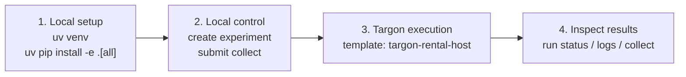
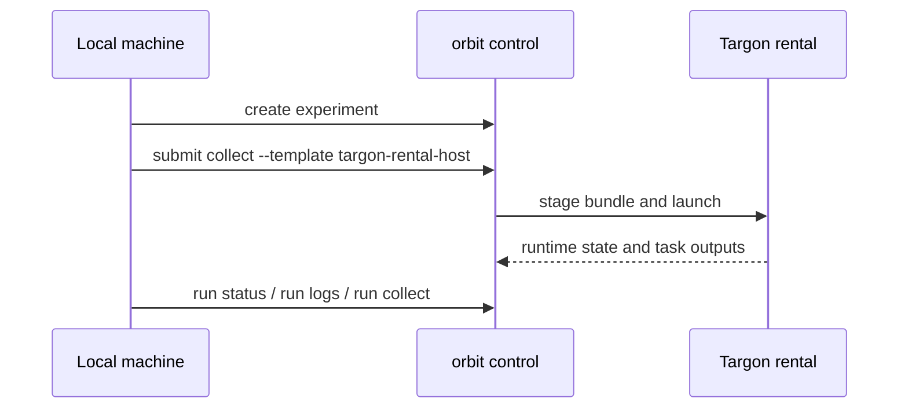

# Getting Started

This guide is the recommended first stop for new users. It focuses on the
primary validated deployment pattern for this repository: run the control plane
locally and execute jobs on a Targon rental.



## Who This Project Is For

ORBIT is a good fit if you want to:

- submit training, evaluation, or collection jobs from your local machine
- run those jobs on Targon rentals through explicit execution templates
- collect logs and artifacts without hand-writing the remote orchestration

If you mainly want local-only bundle debugging, that path exists, but it is not
the default entrypoint for new users.

## Recommended First Run

The recommended first run is:

- local `control`
- remote `targon_rental`
- launch mode `host_process`
- template `targon-rental-host`

This is the path currently documented as both recommended and validated.



## Prerequisites

You need:

- Python `>=3.11`
- a local checkout of this repository
- a Targon account and project
- an SSH key registered with Targon

Depending on what you want to do next, you may also need:

- `HF_TOKEN` for training dataset download or artifact/model publishing
- `WANDB_API_KEY` for the official training launch, which defaults to
  `report_to: wandb`

## Install

For a first run, install the full environment:

```bash
uv venv
source .venv/bin/activate
cp .env.example .env
uv pip install -e ".[all]"
```

This documentation assumes `uv` is your default Python environment manager.

Examples in this document use `python3 -m orbit` because it is explicit and
works well inside a `uv`-managed editable checkout.

## Set Up Environment

For the quick start in this guide, set these values in `.env` or export them in
your shell:

```dotenv
TARGON_API_KEY=...
TARGON_PROJECT_ID=...
TARGON_SSH_KEY_UID=...
```

You do not need `HF_TOKEN` or `WANDB_API_KEY` for the small remote collection
job shown below.

## Prepare a Targon Target

Targon targets are resolved explicitly. In practice that means:

- the `--target` name should point to a prepared rental target
- the target is typically resolved through `machines.json`
- you should pass `--target` explicitly for remote commands rather than relying
  on implicit defaults

If you are validating or testing a path, use an isolated rental rather than a
shared machine.

To see the supported execution templates:

```bash
python3 -m orbit control template list
```

The default quick-start template is `targon-rental-host`.

## Run Your First Remote Job

1. Confirm the control-plane CLI loads:

```bash
python3 -m orbit control --help
```

2. Create an experiment record:

```bash
python3 -m orbit control experiment create \
  --id targon-quickstart \
  --variable "remote collection smoke" \
  --hypothesis "local control can submit a small NAVWORLD job to Targon" \
  --train-config '{}' \
  --data-config '{}'
```

3. Submit a lightweight collection job to Targon:

```bash
python3 -m orbit control submit collect \
  targon-quickstart \
  --template targon-rental-host \
  --env NAVWORLD \
  -n 1 \
  -o navworld.jsonl \
  --bundle-dir /tmp/personal-project-targon-quickstart \
  --target <target-machine> \
  --foreground
```

4. Inspect and collect the run:

```bash
python3 -m orbit control run status targon-quickstart collect
python3 -m orbit control run logs targon-quickstart collect --tail 100
python3 -m orbit control run collect targon-quickstart collect
```

## What To Expect

After `run collect`, inspect the bundle directory that you passed with
`--bundle-dir`.

Important locations:

- `artifacts/`: task stdout, stderr, and collected task outputs
- `runtime/runtime.log`: execution-plane events such as staging, launch,
  status probes, and artifact collection

As a rule of thumb:

- read `artifacts/*.log` when you care about task behavior
- read `runtime/runtime.log` when you care about remote execution behavior

## Next Steps

- For the full production-style training launch, read
  [official-examples.md](official-examples.md).
- For architecture and support-maturity context, read
  [architecture.md](architecture.md).
- For command-family guidance, read [cli.md](cli.md).
- For machine, image, and environment details, read [operations.md](operations.md).

## Secondary Local Debugging Path

Local-only worker flows are still useful for debugging, but they are not the
recommended first experience for this project.

Use them when you already have a bundle and want to debug execution locally
before moving the job to Targon.
